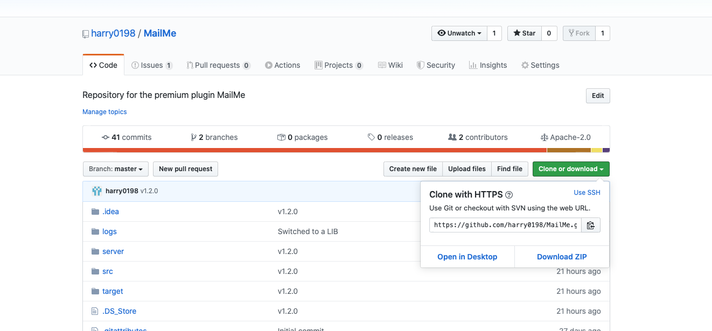
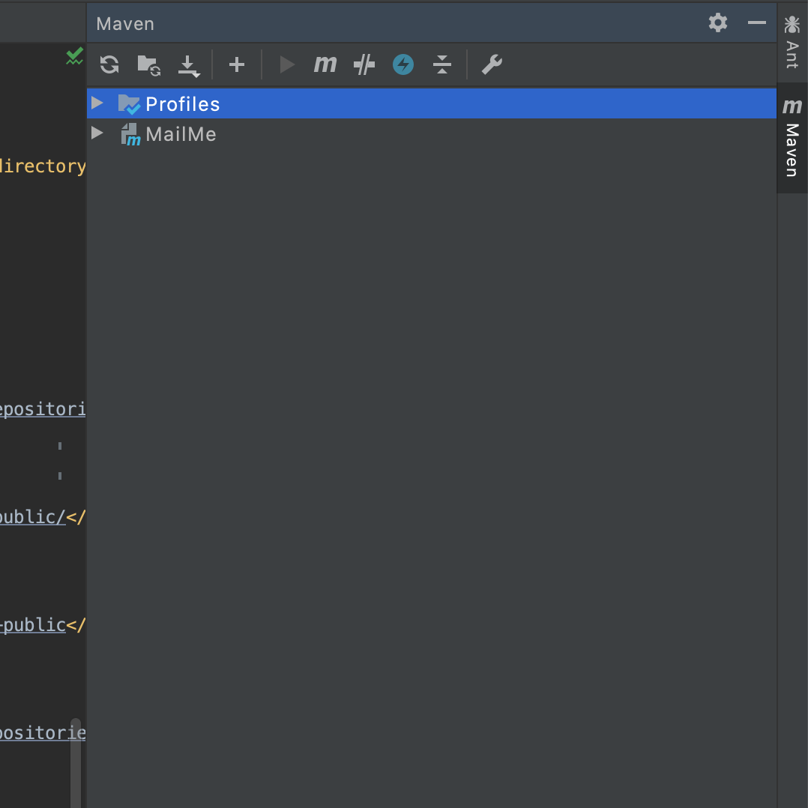

# API

## Getting an Instance

This can be done after applying it as a dependency using

```bash
MailMe mailMe = MailMe.getInstance();
```

## As a Dependency

**Using Maven:**

1. Navigate to the mailme [repository](https://github.com/harry0198/MailMe)
2. Click the green button and clone the repository



3. Open the code in your IDE and run the maven build task install

```
mvn install
```


 This will create a jar in your local repository for you to use


4. Next, in your own project. Add the maven dependency:


```bash
<!-- MailMe -->
<dependency>
            <groupId>com.haroldstudios.mailme</groupId>
            <artifactId>MailMe</artifactId>
            <version>LATEST</version>
            <scope>provided</scope>
</dependency>
```


**Importing Manually**

**If you already own the MailMe plugin, you can just use the plugin jar from the resource home page.**

1. Navigate to the mailme [repository](https://github.com/harry0198/MailMe)
2. Click the green button and clone the repository
3. Open up the code in your IDE and run the maven build task package

```bash
mvn package
```

In IntelliJ IDEA, the maven build tasks are found here, on the right hand side. Click the "M" icon on the menu here to enter the build task:



4. Add it to your build path


