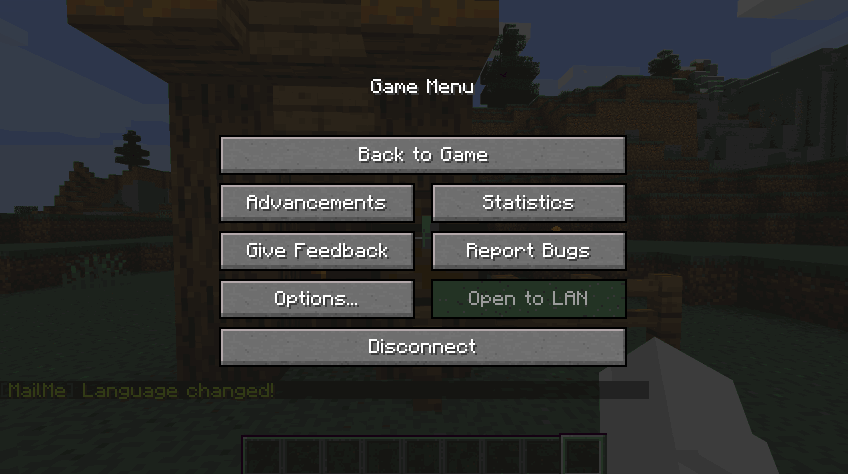

# MailBoxes

## Setting a MailBox

Setting a mailbox is pretty self-explanatory process.

1. Aim at a CHEST you wish to set as your mailbox
2. Execute the command /mailme mailbox set
3. Complete! Your mailbox has now been set at the chest location you're looking at. 


Please note this can ONLY be a chest. Thus Trapped Chest, Shulker etc are not valid mailboxes




## Removing a MailBox

Removing your mailbox is almost the same as setting your mailbox. 

Just follow the same steps as setting a mailbox with the one alteration of instead typing the command 

```bash
/mailme mailbox remove
```

## Setting a Default MailBox

To set a default mailbox, follow the same steps as setting your own mailbox with the one alteration of using the command 

```bash
/mailme defaultMB
```


This command sets NEW players' default mailbox. Not existing. Therefore, if a player has joined the server since the plugin being installed - it will not update their mailbox. To fix this, you can remove their playerdata but this will also delete all their mail.


